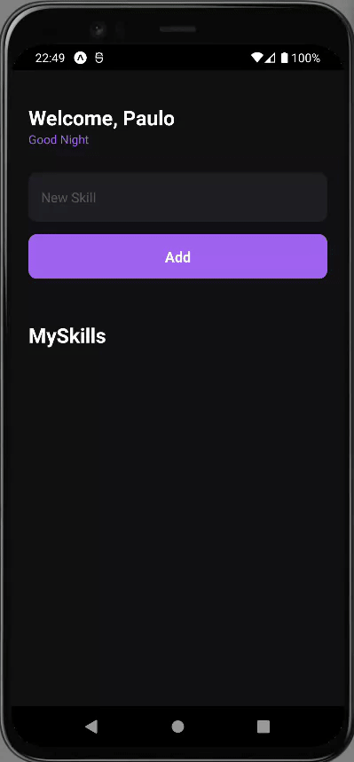

<div align="center">
   <a href="#-tecnologias-utilizadas">
      
      
      
   </a>
</div>
                                                                     
<h1 align="center">:file_cabinet: MySkills</h1>  

<p align="center">
  
</p>
                                                             


## :memo: Projeto
Nesse projeto foi desenvolvido um aplicativo para adicionar e remover skills. Foi desenvolvido em TypeScripe e também utilizamos alguns hooks do react, como useState e o useEffect.


## :wrench: Tecnologias utilizadas
* [React Native](https://reactnative.dev/)
* [Typescript](https://www.typescriptlang.org/)
* [Expo](https://expo.dev/)

## :rocket: Rodando o projeto

```bash
# Execute o comando git clone para realizar o clone do repositório
$ git clone https://github.com/pcaldi/myskills.git
# ou execute
$ gh repo clone pcaldi/myskills
# Entre na pasta do repositório clonado
$ cd myskills
```

Dependências e inicialização:

```bash
## instalar dependências
$ npx expo install
# inicializar expo
$ npx expo start
```
## 📲 Contato

Entre em contato comigo por e-mail ou pelo meu Linkedin:

<a href="mailto:pcaldi@gmail.com"></a>

<a href="https://www.linkedin.com/in/pcaldi/"></a>


## :closed_book: Licença
<a>
  
</a>

Esse projeto possui [licença MIT](./LICENSE).


